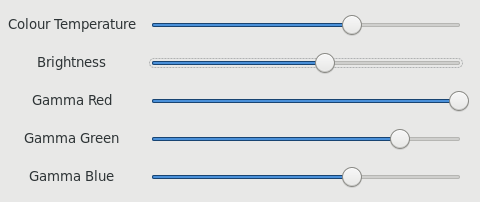

This is a UI that uses redshift to control the display color temperature
and brightness in real time.



# Building

To build, simply:

```bash
./bootstrap
./configure
make && make install
```

## Existing Redshift

This installs its own copy of redshift which will clobber any existing
installations. If you have an existing installation, you should
configure using the `--without-redshift` option, so:

```bash
./bootstrap
./configure --without-redshift
make && make install
```
